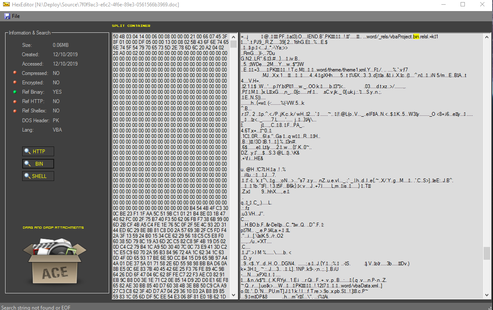

# HexEditor
How to look at a file without pissing off whatever's inside

So there I was at work and people kept sending over these rando files that had appeared in their Outlook inboxen, having gotten past the firewall (running av), email server (running a different av), and their desktop (still another av). They wanted me to tell them if the files were safe. How, if I open a word doc or whatev, I risk executing whatever might be inside. But I can't just delete them, they might be legitimate orders from customers. I don't have a sandbox readily available. So I needed a way to look inside these things without pissing something off.

HedEditor gives me a few tools to help. Simply hex editing a file shouldn't cause whatever might be inside to execute, especially if it's a PDF with a 'click me to get something bad' link that users love to click on. We can look at some of the attributes of the file and tell if it's encrypted or compressed, we can look through the raw bytes and see if there any human readable strings referencing suspicious stuff like SHELLEX, BIN or HTTP. I see those frequently in stuff that gets in. We have a few buttons that will jump to those positions in the file if I want to eyeball them. Drag and drop works for Outlook attachments but not from explorer and I need to fix that.

</img> 
